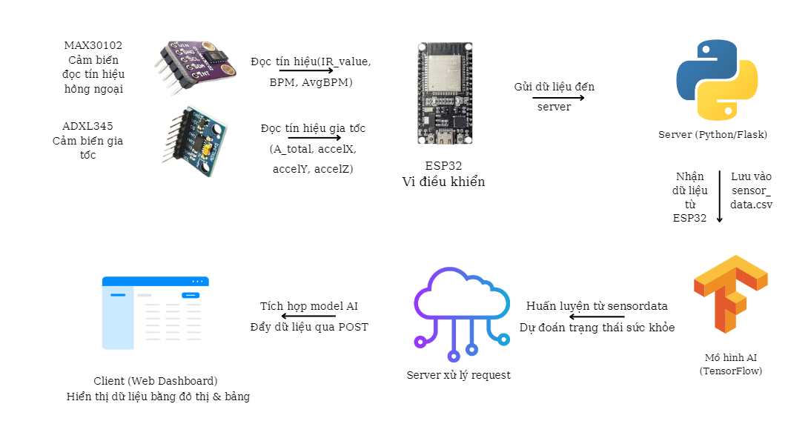
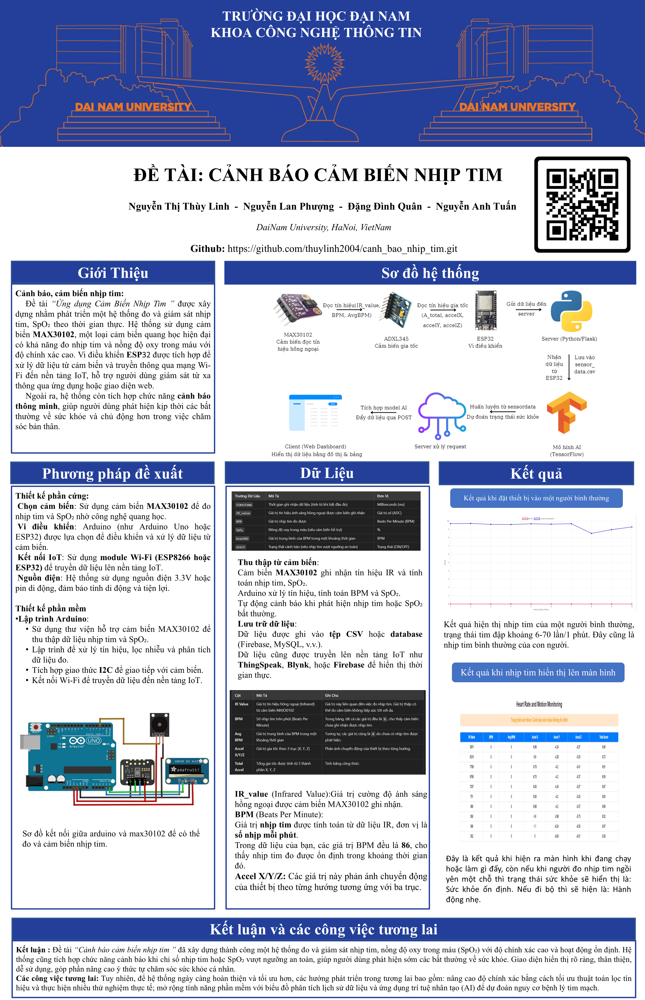

<h1 align="center">THIẾT BỊ DỰ ĐOÁN SỨC KHỎE TỪ CẢM BIẾN MAX30102</h1>

<div align="center">

<p align="center">
  
</p>

[](https://www.facebook.com/DNUAIoTLab)
[](https://fitdnu.net/)
[](https://dainam.edu.vn)
</div>

<h2 align="center">Hệ thống theo dõi sức khỏe theo thời gian thực</h2>

<p align="left">
  Hệ thống này sử dụng ESP32 để thu thập dữ liệu nhịp tim (MAX30102) và gia tốc (ADXL345), sau đó gửi dữ liệu về server Flask để xử lý bằng mô hình AI. Giao diện web hiển thị thông tin sức khỏe theo thời gian thực và cảnh báo khi phát hiện bất thường.
</p>

---

## 🌟 Giới thiệu

- **📌 Theo dõi sức khỏe:** Ghi nhận nhịp tim và gia tốc để xác định trạng thái vận động.
- **💡 Cảnh báo bất thường:** Hệ thống hiển thị cảnh báo khi nhịp tim vượt quá ngưỡng an toàn.
- **📊 Xử lý AI:** Mô hình TensorFlow phân loại trạng thái sức khỏe dựa trên dữ liệu cảm biến.
- **🖥️ Giao diện thân thiện:** Web app cập nhật dữ liệu theo thời gian thực.

---

## 🏗️ SƠ ĐỒ KẾT NỐI

<p align="center">
  
</p>

### 🔩 Kết nối phần cứng:

| **ESP32** | **MAX30102** | **ADXL345** |
| --------- | ------------ | ----------- |
| 3.3V      | VCC          | VCC         |
| GND       | GND          | GND         |
| 21 (SDA)  | SDA          | SDA         |
| 22 (SCL)  | SCL          | SCL         |

---

## 📂 Cấu trúc dự án

📦 Project  
├── 📂 data # Dữ liệu thu thập  
├── 📂 models # Mô hình AI  
├── 📂 templates # Giao diện web  
│ ├── index.html # Hiển thị dữ liệu trên web  
├── sketch_feb22b.ino # Code Arduino gửi dữ liệu từ ESP32  
├── model.py # Huấn luyện mô hình AI  
├── server.py # Chạy server Flask  
├── sensor_data.csv # Lưu dữ liệu cảm biến  
├── health_model.h5 # Mô hình AI đã huấn luyện  
├── scaler.pkl # Chuẩn hóa dữ liệu  
├── label_encoder.pkl # Mã hóa nhãn

---

## 🛠️ CÔNG NGHỆ SỬ DỤNG

<div align="center">

### 📡 Phần cứng

[]()
[]()
[]()

### 🖥️ Phần mềm

[]()
[]()
[]()
[]()

</div>

## 🚀 Hướng dẫn cài đặt và chạy

1️⃣ **Nạp code vào ESP32**

- Mở **Arduino IDE**, tải file `sketch_feb22b.ino` và nạp lên ESP32.

2️⃣ **Cài đặt thư viện Python**

```bash
pip install flask==3.1.0
pip install pandas==1.5.3
pip install numpy==1.24.0
pip install tensorflow  # TensorFlow chưa được cài đặt, sẽ cài phiên bản mới nhất
pip install joblib==1.4.2
pip install scikit-learn==1.1.3
```

3️⃣ **Huấn luyện mô hình AI**

```bash
python model.py
```

4️⃣ **Chạy server Flask**

```bash
python server.py
```

5️⃣ **Truy cập giao diện web**

- Mở trình duyệt, nhập địa chỉ:

```
http://localhost:5000
```

---

## 📖 Hướng dẫn sử dụng

1️⃣ **ESP32 gửi dữ liệu cảm biến**

- Nhịp tim từ **MAX30102**, gia tốc từ **ADXL345**.
- Gửi qua WiFi về **server Flask**.

2️⃣ **Flask nhận dữ liệu & xử lý**

- Nhận dữ liệu POST từ ESP32.
- Dự đoán trạng thái sức khỏe bằng mô hình AI.
- Trả kết quả về giao diện web.

3️⃣ **Giao diện web hiển thị dữ liệu**

- **Bảng dữ liệu** cập nhật liên tục.
- **Biểu đồ nhịp tim & gia tốc** thời gian thực.
- **Cảnh báo sức khỏe** nếu có bất thường.

---
## 📰 Poster
<p align="center">
  
</p>

## 🤝 Đóng góp
Dự án được phát triển bởi 4 thành viên:

| Họ và Tên            | Vai trò                  |
|----------------------|--------------------------|
| Nguyễn Thị Thùy Linh | Phát triển toàn bộ mã nguồn, thiết kế cơ sở dữ liệu, kiểm thử và triển khai dự án .|
| Nguyễn Anh Tuấn      | Biên soạn tài liệu Overleaf và hỗ trợ bài tập lớn.|
| Đặng Đình Quân    | Thiết kế slide PowerPoint, Poster, hỗ trợ bài tập lớn.|
| Nguyễn Lan Phượng     | Hỗ trợ bài tập lớn, thuyết trình và thực hiện video giới thiệu.|

© 2025 NHÓM 4, CNTT16-05, TRƯỜNG ĐẠI HỌC ĐẠI NAM
